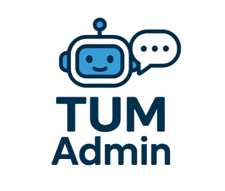

<p align="center">
  
</p>


<p align="center">
  <b>AI-powered Document Generator for University Administration</b>
</p>

---

## 📝 About TUM Admin

**TUM Admin** is an intelligent document generation tool designed for university administrative staff and faculty. It leverages the latest Gemini Flash 2.0 LLM to help you quickly create, refine, and export official documents such as announcements, student communications, and meeting summaries with just a few clicks.

---

## ✨ Features

- **AI-Powered Document Generation:** Instantly create professional documents tailored to your needs.
- **Refinement Workflow:** Easily refine and update documents through conversational prompts.
- **Multiple Document Types:** Supports announcements, student communications, meeting summaries, and more.
- **Tone Customization:** Choose the tone that best fits your message (formal, informal, etc.).
- **Export Options:** Download documents as PDF or DOCX files.
- **History Tracking:** Access and manage all previously generated documents.
- **User-Friendly Interface:** Clean, modern UI built with Streamlit.
- **Language Options:** English and German supported.

---

## 🎬 Demo

<!-- Replace the link below with your GIF demo when ready -->
<p align="center">
  
</p>

---

## 🚀 Try it Online

[](https://tum-admn.streamlit.app/)

---

## 🛠️ Getting Started

### 1. **Clone the Repository**

```bash
git clone https://github.com/yourusername/TUM_Admin.git
cd TUM_Admin/TUM-Admin
```

### 2. **Install Dependencies**

It is recommended to use a virtual environment:

```bash
python -m venv venv
source venv/bin/activate  # On Windows: venv\Scripts\activate
pip install -r requirements.txt
```

### 3. **Set Up Environment Variables**

Create a `.env` file in the `TUM-Admin` directory and add your Google API key for Gemini Flash 2.0:

```
GOOGLE_API_KEY=your_gemini_api_key_here
```

> **Note:** We use Gemini Flash 2.0, not OpenAI.

### 4. **Run the App**

```bash
streamlit run streamlit_app.py
```

The app will open in your browser at `http://localhost:8501`.

---

## 🖥️ Tech Stack

| Component     | Technology            |
|---------------|------------------------|
| Frontend      | Streamlit              |
| Backend       | Python + Gemini Flash 2.0 API |
| Export        | PDF/DOCX via Python libraries |
| Deployment    | Streamlit Cloud        |

---

## 📂 Project Structure

```
TUM-Admin/
  ├── assets/
  │   └── TUM_Admin_logo.PNG
  ├── document_models.py
  ├── export_service.py
  ├── llm_service.py
  ├── requirements.txt
  ├── streamlit_app.py
  └── README.md
```


## 📢 Example Use Case

> “Write an announcement to inform students about the extension of registration deadline until Oct 15. Use friendly tone.”

📤 Output:

> "Dear Students,
> We’re happy to inform you that the registration deadline has been extended until October 15..."

---

## 🤝 Authors

* Ahmet Cemil Yazıcı
* Pelin Elbin Günay
* Banu Uygun
* Mohammed Ezzat
* Yiğit Ertör
* Ramazan Tuncel

📍 TUM – School of Computation, Information and Technology
🗓️ July 2025

